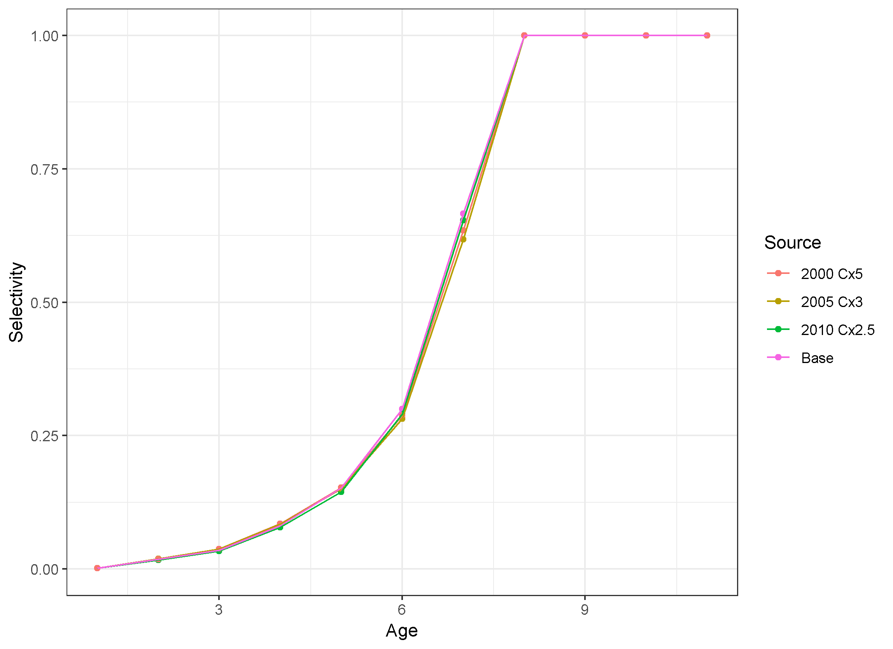
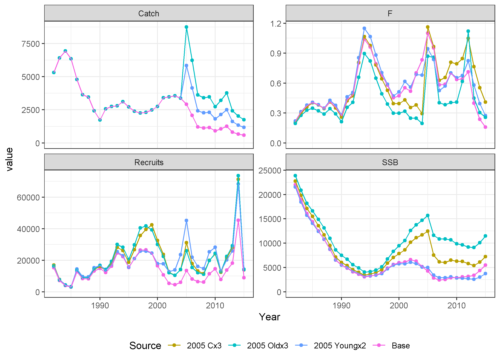
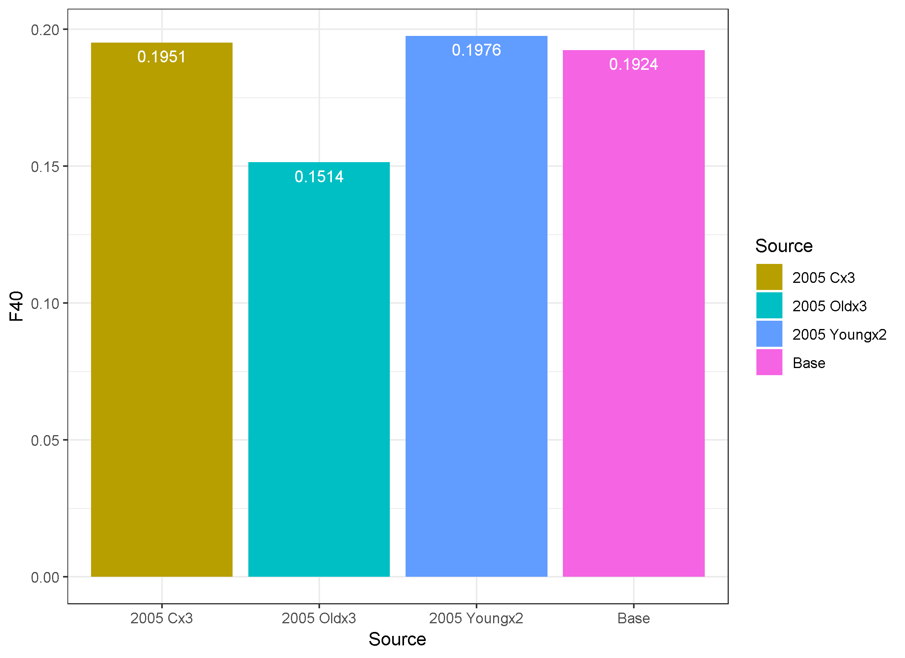
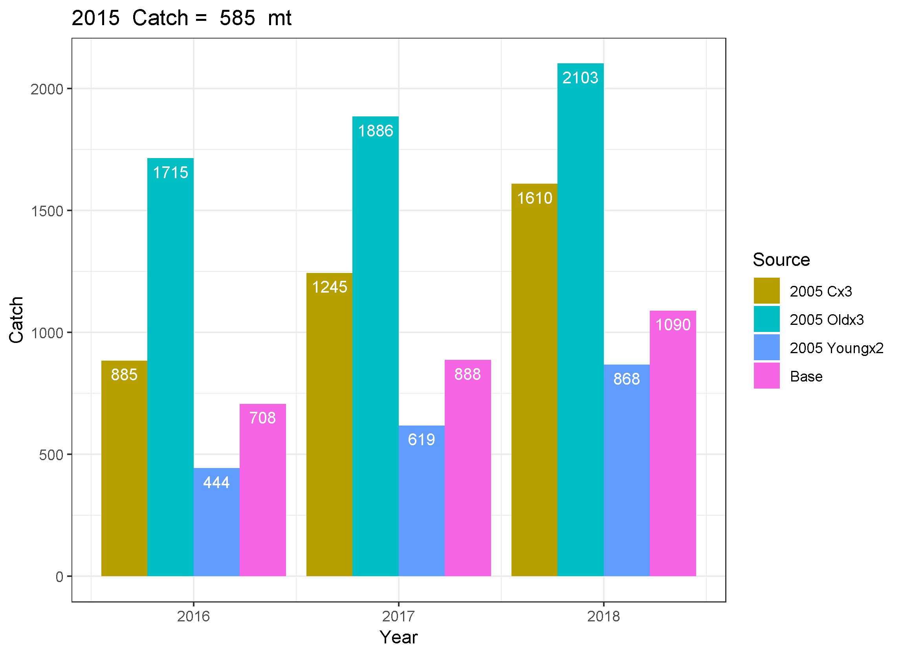

## Question: can adding recent catch allow increase in quota? Yes, maybe.

The premise of this exercise is that if missing catch is the source of the groundfish retrospective patterns, and this missing catch was added into the assessment, the quota could be increased under the assumption that the missing catch was converted to observed catch.  For example, if the missing catch was due to changes in discarding behavior when observers were on board, then 100% observer coverage would eliminate this missing catch. Results for a recent groundfish example demonstrate the potential of this approach, but also show a number of challenges including the multiple ways that missing catch can be used to eliminate a retrospective pattern and the consequent multiple possible changes in ABC. In all cases, the potential increase in quota is less than the amount of missing catch, so there is not a simple rule that can be applied. In some cases, there may not even be an increase in quota possible. The danger of this approach is that if missing catch continues in the future when it is assumed to stop, then the increased quota will almost certainly result in overfishing.

## What was done?

A stock assessment that exhibited a strong retrospective pattern was used as a starting point. Amounts of missing catch were searched for that elimated the retrospective pattern for different starting years and different age selectivities. These modified assessments were followed through to catch advice applying an F40% rule to compare with the original assessment and the original assessment with retrospective adjustment. Differences between the modified and base quotas indicated the potential for an increase in the quota if the missing catch was assumed to stop due to increased monitoring.

### Case Study: Witch Flounder (SARC 62, 2016)

The benchmark assessment for witch flounder at SARC 62 rejected the proposed ASAP model due to a strong retrospective pattern and other diagnostic issues (https://www.nefsc.noaa.gov/publications/crd/crd1701/, https://www.nefsc.noaa.gov/publications/crd/crd1703/, and https://www.nefsc.noaa.gov/saw/saw62/sarc62_panel_summary_report.pdf). An ASAP file similar to the final run examined in SARC 62 was used as the starting point for this exercise. This assessment formulation used years 1982-2015, ages 1-11+, one fleet with three selectivity blocks, and five survey tuning indices (NESFS spring and fall scaled by the catchability study, ASMFC summer, and ME/NH spring and fall surveys). This assessment exhibited a strong retrospective pattern with Mohn's rho values of -0.46, 0.64, and 0.39 for the fishing mortality rate (F), spawning stock biomass (SSB), and recruitment, respectively.

This strong retrospective pattern can be eliminated in many different ways. For this exercise, three starting years were selected for catch multipliers: 2000, 2005, and 2010. There was no a priori reason for selecting these years, they were selected to demonstrate a range of possible solutions and potential impact on catch advice. For each starting year, the catch for that year through 2015 was multiplied by a range of values (1.5, 2.0, 2.5, ..., 5.0) and the one that most reduced the retrospective pattern was selected. The catch proportions at age were not changed, meaning the missing catch was assumed to have the same distribution at age as the original catch. The magnitude of the catch multiplier needed to elminate the retrospective pattern varied with the starting year. Starting in 2000 required multiplying the catch by 5.0, while 2005 and 2010 required catch multipliers of 3.0 and 2.5, respectively. All three change year and catch multiplier combinations resulted in the Mohn's rho for SSB between -0.03 and 0.03, meaning essentialy eliminated. 

Click on the following links to see the selected retrospective plots for:
* Change year 2000 https://github.com/cmlegault/gfishexplo/blob/master/witch/retro_F_SSB_R_y2000c50m10.png
* Change year 2005 https://github.com/cmlegault/gfishexplo/blob/master/witch/retro_F_SSB_R_y2005c30m10.png
* Change year 2010 https://github.com/cmlegault/gfishexplo/blob/master/witch/retro_F_SSB_R_y2010c25m10.png

Note the large reduction in the range of each y-axis compared to the base relative retrospective patterns (right column).

These modifications to the catch data changed the time series of estimates for F, recruits, and SSB, as expected. As seen in the top left panel below, the catch time series changed abruptly for the three modified assessments with the 2000 change year resulting in catches much higher than observed in earlier years in the early 2000s and recent catches similar to historical amounts. The 2005 change year time series has a spike in catch in 2005 above historical amounts, but the other values within the previously observed range, and all the modified catches for the 2010 change year case are within the range of previously observed catches. The model accounts for these changed catches by both increasing the population and increasing the fishing mortality rate in recent years, although the 2015 SSB is nearly in the 2010 change year scenario and base case, meaning only the F increased in that year. In each modified case, the F decreases a few years before the modifed catches relative to the base case due to the population having to increase to allow the higher catches later, which requires recruitment to be higher before the catch increases as well. So the changes to the assessment estimates are not limited to the years of changed catch, but instead impact a number of years prior to the change year as well.

Despite the large changes in catch under the three change scenarios, the estimates of fishery selectivity in the final year of the assessment are nearly identical. This is because the catch at age proportions are not changed in these scenarios, the proportions at age in the original fit are assumed to represent the missing catch. This does not have to be the case, but it is the simplest assumption to make. This assumption will be examined using two more scenarios below.

Since the selectivity at age is nearly identical, and the weights, maturity, and natural mortality vectors at age are identical across the four scenarios, the estimates of F40% are nearly identical. F40% is the F that reduces spawning stock biomass per recruit to 40% of the unexploited amount. It was the basis for the F reference point for this stock when an analytical assessment was used. 

For the sake of simplicity, the short term projections for the four cases use the respective F40% value for three years. The typical current year catch is not included in these projections. Each scenario has catch increase over the three years reflecting the positive increase in the population during that period under a constant appropriate catch rate and constant recruitment (mean over the time period of the assessment for each scenario). Due to the low selectivity of young fish (ages 1-4, see above), the recruitment assumption plays a minor role in these catch values. The increases are more due to the reduced fishing mortality rate allowing more fish to survive to older ages when they weigh more and thus contribute more to the catch in weight (metric tons). 

All four scenarios predict increased catch in 2016 relative to 2015 (585 metric tons) when the F40% fishing mortality rate is applied. The largest catch multipliers do in fact result in more catch under F40% than the Base scenario, but the 2010 catch multplied by 2.5 scenario results in lower catch in 2016 than the Base scenario (666 mt vs 708 metric tons). The 2000 catch multiplied by 5 scenario has the highest catch in 2016, but it is only approximately double the Base scenario despite the catch being multiplied by 5. Thus, there is potential for additional quota to be derived from assuming that missing catch is the source of the retrospective pattern. However, the amount of increase in quota is not as large as the amount of missing catch in this case. 

When stocks exhibit strong retrospective patterns, as is the case for this witch flounder example, one way to adjust the catch advice is to modify the starting point of the projections to account for the retrospective pattern. This can be done by multiplying the population estimates at age by 1/(1+Mohn's rho SSB). This means that when the stock size is overestimated (Mohn's rho SSB is positive) the adjusted population will be lower, and thus the projected catch will be lower. If the source of the missing catch in the three scenarios that eliminated the retrospective pattern was assumed to continue in the projections, then the catch advice would be found by dividing the projected catch by the multiplier of missing catch (5, 3, and 2.5 in these scenarios). When these catch adjustments are made, the catch advice is remarkably similar across all four scenarios. Results such as these for other stocks have been used to justify the use of the Mohn's rho adjustment when providing catch advice, although similar to this case the rho adjustment is often found to not reduce the catch as much as alternative "fixes" to the retrospective pattern. Note that comparing the unadjusted catch from the three catch multiplier scenarios with the rho adjusted Base case still does not result in the catch multipliers used to eliminate the retrospective pattern (e.g., 1511/432 < 5, 885/432 < 3, and 666/432 < 2.5). Thus, in all three missing catch scenarios, the amount of potential quota increase is less than the amount of missing catch needed to eliminate the retrospective pattern.

The story seems quite straight forward so far, but what if the missing catch has a different age composition than the modeled catch? For example, the missing catch could be due to discarding of predominantly young fish or due to not reporting catch of old fish that is sold on the black market. This complicates the picture quite a bit. For starters, there has to be some basis for setting the selectivity pattern for the missing catch, since by definition there cannot be sampling of catch that is not seen. For demonstration purposes, two scenarios were created based on missing catch starting in 2005. The Young scenario sets the selectivity at age for an added fleet to 1.0 for ages 2, 3, 4, and 5 and sets selectivity for the remaining ages (1, 6-11+) to 0.1. The Old scenario sets the selectivity at age for an added fleet to 1.0 for ages 9, 10, and 11+ and set selectivity for the remaining ages (1-8) to 0.0. These two cases were compared with the Base case and the 2005 Cx3 case to demonstrate the importance of the selectivity associated with the missing catch for a fixed change year. Note the colors for the Base and 2005 Cx3 scenarios are the same as in the plots above to facilitate comparisons.

A few technical details about the Young and Old runs:
* a second fleet was added for the missing catch and effective sample size for catch at age set to zero for all years
* catch in the added fleet for years prior to 2005 was set to 0.1 mt
* CV for catch in both fleets was reduced from 0.1 in the original run to 0.05 to force closer matching to the added catch
* the phase for Fmult deviations was changed from 3 to 2 due to the added fleet having an abrupt change from 0.1 mt to high catches in 2005.

For years 2005 onwards, the catch amount for fleet 2 was a multiple of catch for fleet 1 at the young or old ages.  In this way, the the sum of fleet 1 and fleet 2 catch would reflect the unreported missing catch from either the younger or older fishes. This allows ASAP to remove fish according to the assumed selectivity pattern for the second fleet and still estimate selectivity for the original fleet. The 2005 Old scenario was quite similar to the 2005 Change Year due to the similarity of the assumed selectivity to that estimated for the original fleet (see plot above). The 2005 Young scenario initially reduced the Mohn's rho for SSB as catch increased, but past a doubling of the catch it started to increase. Thus, the selectivity pattern impacts the ability of missing catch to eliminate a retrospective pattern at all. The 2005 Young catch times two case is continued below as the best option, but don't forget that the retro was not fully removed for this case. 

Click on the following links to see the selected retrospective plots for:
* Change year 2000 https://github.com/cmlegault/gfishexplo/blob/master/witch/retro_F_SSB_R_Old_y2005c30.png
* Change year 2005 https://github.com/cmlegault/gfishexplo/blob/master/witch/retro_F_SSB_R_Young_y2005c20.png

Note these "fixes" to the retrospective pattern are not as well-behaved as the cases shown previously, with larger offsets and higher retrospective patterns in F.

These modifications to the catch data again changed the time series of estimates for F, recruits, and SSB, as expected. Note the 2005 Cx3 and 2005 Oldx3 scenarios are identical for the catch plot, but differ for F, recruits, and SSB, showing the importance of the selectivity pattern associated with the missing catch.

The selectivity patterns for the original fleet are generally similar to the base case (solid lines), with the Old scenario differing more than the Young scenario. The overall selectivity, including the missing catch, causes large changes in both scenarios (dashed lines). 

The assumption is that the missing catch is an artifact that should be removed, so only the original fleet selectivity pattern is used to compute F40 (solid lines in plot above), resulting in similar values across the scenarios. The lower F40 for the Old scenario is offset by the increased selectivity of younger ages seen above.

Due to the large differences in stock size and age structure in the terminal year, the short term projections under F40 for the Old and Young scenarios are quite different from the Base projections. Comparing the Old scenario with the missing catch having the same selectivity as the reported catch shows a larger potential for increasing the ABC, if the missing catch is eliminated. However, the Young scenario results in essentially the same catch advice as the rho adjusted Base scenario, indicating no ability to increase the ABC if the missing catch is eliminated. But remember that the Young scenario did not remove the retrospective pattern, so may not be accepted as a basis for management advice without rho adjustment, which would reduce the catch advice even more.

Adjusting for the missing catch brings the catches more in alignment, as seen above. Comparing the unadjusted catch advice for the Old and Young scenarios with the rho adjusted Base case shows the amount of potential increased quota is again less than the amount of missing catch (1715/432 < 3 and 444/432 < 2).  

## Concluding thoughts

* In general, retrospective patterns can be removed by adjusting catch or natural mortality (or a combination of the two) at some point(s) in the time series, for some group of ages. Other modifications can also address the retrospective pattern, including allowing survey catchability to change over time, changes in selectivity patterns, or inclusion of process error. There are endless combinations of adjustments that can result in eliminating the retrospective pattern.
* For the simple catch-only adjustments explored here in the witch flounder example, the amount of missing catch required to reduce/eliminate the retrospective pattern depended the year that misreporting started and the age distribution of the missing catch relative to the reported catch.
* Although not examined directly, the overfished and overfishing status determinations would also play a role in the setting of quotas, along with inclusion of the estimated catch in the first year of projections. These status determinations would not be expected to change under any of the scenarios examined, but the specific results would require examination of rebuilding trajectories and could reduce or eliminate any potential increases in quota due to elimination of missing catch.
* Assuming that unreported catch is the only source of the retrospective pattern, and ignoring rebuilding issues, then quotas calcuated from assessments with adjusted catch that assume the misreporting ends are larger. However, the amount of increase is generally less than the amount of catch needed to eliminate the retrospective, and the amount of catch varies depending on when it starts and its age distribution. So there is not a simple 1:1 relationship between the amount of missing catch needed to eliminate the retrospective pattern and the amount of quota increase that results from including that missing catch in the assessment.
* There is the potential for this approach of increasing the quota to account for missing catch to be perceived as rewarding bad behavior.
* Returning to the witch flounder catch time series, there are some obvious spikes and unusual patterns in all the catch multiplier scenarios relative to the base case. If additional information was available, or it was thought that large sudden changes in catch were unlikely, then it might be possible to select a single year to assume when the change in catch occurred. Alternatively, there could be some sort of ramp associated with missing catch starting slowly and building to a larger amount over time as incentives for it increased. This would further complicate the relationship between the size of the retrospective pattern and whether additional quota could be associated with eliminating missing catch. This highlights the need for accurate catch reporting in all parts of the fishery.
* If natural mortality, instead of missing catch, is in fact the source of the retrospective pattern, then there is no basis for increasing the quota regardless of changes to monitoring or management to address potential missing catch. Issues with which ages are impacted by the changes in natural mortality would need to be addressed as well. It is possible that the retrospective pattern is not entirely due to a single cause (only missing catch or only natural mortality change). The possibility that both natural mortality and catch reporting could be changing at different times, possibly for different ages, makes this a highly complex problem.
* The exercise for missing catch was repeated for natural mortality multipliers for change years 2000, 2005, and 2010. The F40 was calculated assuming the original M (0.15) but the increased M to remove the retrospective pattern was assumed to continue in the short term projections. See       https://github.com/cmlegault/gfishexplo/blob/master/witch/mmult.pdf for a similar series of plots to those shown above and  
https://github.com/cmlegault/gfishexplo/blob/master/witch/retro_F_SSB_R_y2000c10m25.png,   https://github.com/cmlegault/gfishexplo/blob/master/witch/retro_F_SSB_R_y2005c10m25.png, and   https://github.com/cmlegault/gfishexplo/blob/master/witch/retro_F_SSB_R_y2010c10m35.png  
for the retrospective plots of the selected cases.
* The ability to increase the quota due to missing catch depends on the assumption that the missing catch is eliminated. If this assumption is not met, and the source of the missing catch continues, then increasing the quota will result in much higher catch than desired, almost certainly resulting in overfishing. Thus, this approach should be used only in cases where there is strong evidence for missing catch as the source of the retrospective pattern, and where there is an expectation that management or monitoring changes will result in the elimination of underreporting.

Special thanks to Liz Brooks for feedback on an earlier description of this work.
