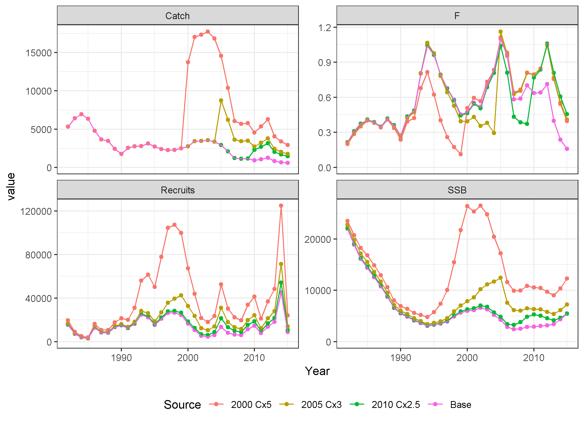

# gfishexplo
Groundfish Explorations

## Question: can adding recent catch allow increase in quota? Yes, maybe.

Premise is that missing catch, due to underestimated discards, discarding of legal-sized fish, and improperly labelled landings, could be the main source of retrospective patterns in recent groundfish stock assessments. This work explores this concept with the hypothesis that ABCs could be increased if this is true to offset management measures such as 100% observer coverage or dockside monitoring. 

## What was done?

A stock assessment that exhibited a strong retrospective pattern was used as a starting point. Catch multipliers were searched for that elimated the retrospective pattern for different starting years. These modified assessments were followed through to catch advice applying an F40% rule to compare with the original assessment and the original assessment with retrospective adjustment.

### Case Study 1: Witch Flounder (SARC 62, 2016)

The benchmark assessment for witch flounder at SARC 62 rejected the proposed ASAP model due to a strong retrospective pattern (https://www.nefsc.noaa.gov/publications/crd/crd1701/, https://www.nefsc.noaa.gov/publications/crd/crd1703/, and https://www.nefsc.noaa.gov/saw/saw62/sarc62_panel_summary_report.pdf). An ASAP file similar to the final run examined in SARC 62 was used as the starting point for this exercise. This assessment formulation used years 1982-2015, ages 1-11+, one fleet with three selectivity blocks, and five survey tuning indices (NESFS spring and fall scaled by the catchability study, ASMFC summer, and ME/NH spring and fall surveys). This assessment exhibited a strong retrospective pattern with Mohn's rho values of 0.64 and -0.46 for SSB and F, respectively.

This strong retrospective pattern can be eliminated in many different ways. For this exercise, three starting years were selected for catch multipliers: 2000, 2005, and 2010. There was no a priori reason for selecting these years, they were selected to demonstrate a range of possible solutions and potential impact on catch advice. For each starting year, the catch for that year through 2015 was multiplied by a range of values (1.5, 2.0, 2.5, ..., 5.0) and the one that most reduced the retrospective pattern was selected. The catch proportions at age were not changed, meaning the new catch was assumed to have the same distribution at age as the original catch. The magnitude of the catch multiplier needed to elminate the retrospective pattern varied with the starting year. Starting in 2000 required multiplying the catch by 5.0, while 2005 and 2010 required catch multipliers of 3.0 and 2.5, respectively. All three change year and catch multiplier combinations resulted in the Mohn's rho for SSB between -0.03 and 0.03, meaning essentialy eliminated. 

These modifications to the catch data changed the time series of estimates for SSB, F, and recruits, as expected. As seen in the top left panel below, the catch time series changed abruptly for the three modified assessments with the 2000 change year resulting in catches much higher than observed in earlier years in the early 2000s and recent catches similar to historical amounts. The 2005 change year time series has a spike in catch in 2005 above historical amounts, but the other values within the previously observed range, and all the modified catches for the 2010 change year case are within the range of previously observed catches. The model accounts for these changed catches by both increasing the population and increasing the fishing mortality rate in recent years, although the SSB is nearly identical in 2015 under the 2010 change year scenario to the base case, meaning only the F increased in that year. The F decreases a few years before the modifed catches in each case relative to the base case due to the population having to increase to allow the higher catches later, which requires recruitment to be higher before the catch increases as well. So the changes to the assessment estimates are not limited to the years of changed catch, but instead impact a number of years prior to the change year as well.

Note to self: need to add text here...

Note to self: need to add text here...

Note to self: need to add text here...

Note to self: need to add text here...

Note to self: some things to discuss
* not using current year catch in projections for simplicity
* return to first question answer of yes, maybe
* difficulty of age comp diff from total catch (e.g., only small discards or only big fish missing)
* think about repeating for other stocks
* figure out what to keep in witch dir and clean out rundir (save somewhere until sure don't need things)
* M and other potential sources of retros
* run ASAPplots completely to get the retro plots with rho values shown
* what else???
