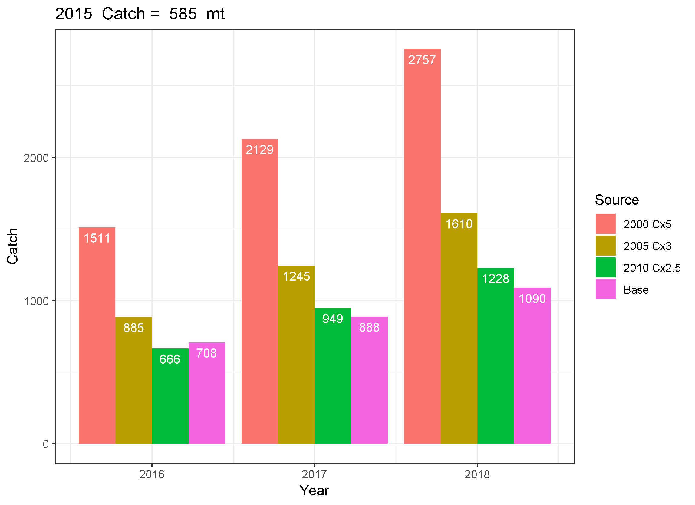

# gfishexplo
Groundfish Explorations

## Question: can adding recent catch allow increase in quota? Yes, maybe.

Premise is that missing catch, due to underestimated discards, discarding of legal-sized fish, and improperly labelled landings, could be the main source of retrospective patterns in recent groundfish stock assessments. This work explores this concept with the hypothesis that ABCs could be increased if this is true to offset management measures such as 100% observer coverage or dockside monitoring. However, the amount of increase is not equal to the amount of missing catch and may depend on the age composition of the missing catch. 

## What was done?

A stock assessment that exhibited a strong retrospective pattern was used as a starting point. Catch multipliers were searched for that elimated the retrospective pattern for different starting years. These modified assessments were followed through to catch advice applying an F40% rule to compare with the original assessment and the original assessment with retrospective adjustment.

### Case Study 1: Witch Flounder (SARC 62, 2016)

The benchmark assessment for witch flounder at SARC 62 rejected the proposed ASAP model due to a strong retrospective pattern (https://www.nefsc.noaa.gov/publications/crd/crd1701/, https://www.nefsc.noaa.gov/publications/crd/crd1703/, and https://www.nefsc.noaa.gov/saw/saw62/sarc62_panel_summary_report.pdf). An ASAP file similar to the final run examined in SARC 62 was used as the starting point for this exercise. This assessment formulation used years 1982-2015, ages 1-11+, one fleet with three selectivity blocks, and five survey tuning indices (NESFS spring and fall scaled by the catchability study, ASMFC summer, and ME/NH spring and fall surveys). This assessment exhibited a strong retrospective pattern with Mohn's rho values of -0.46, 0.64, and 0.39 for F, SSB, and recruitment, respectively.

This strong retrospective pattern can be eliminated in many different ways. For this exercise, three starting years were selected for catch multipliers: 2000, 2005, and 2010. There was no a priori reason for selecting these years, they were selected to demonstrate a range of possible solutions and potential impact on catch advice. For each starting year, the catch for that year through 2015 was multiplied by a range of values (1.5, 2.0, 2.5, ..., 5.0) and the one that most reduced the retrospective pattern was selected. The catch proportions at age were not changed, meaning the new catch was assumed to have the same distribution at age as the original catch. The magnitude of the catch multiplier needed to elminate the retrospective pattern varied with the starting year. Starting in 2000 required multiplying the catch by 5.0, while 2005 and 2010 required catch multipliers of 3.0 and 2.5, respectively. All three change year and catch multiplier combinations resulted in the Mohn's rho for SSB between -0.03 and 0.03, meaning essentialy eliminated. 

Click on the following links to see the retrospective plots for:
* Change year 2000 https://https://github.com/cmlegault/gfishexplo/retro_F_SSB_R_y2000c50m10.png
* Change year 2005 https://https://github.com/cmlegault/gfishexplo/retro_F_SSB_R_y2005c30m10.png
* Change year 2010 https://https://github.com/cmlegault/gfishexplo/retro_F_SSB_R_y2010c25m10.png

These modifications to the catch data changed the time series of estimates for SSB, F, and recruits, as expected. As seen in the top left panel below, the catch time series changed abruptly for the three modified assessments with the 2000 change year resulting in catches much higher than observed in earlier years in the early 2000s and recent catches similar to historical amounts. The 2005 change year time series has a spike in catch in 2005 above historical amounts, but the other values within the previously observed range, and all the modified catches for the 2010 change year case are within the range of previously observed catches. The model accounts for these changed catches by both increasing the population and increasing the fishing mortality rate in recent years, although the SSB is nearly identical in 2015 under the 2010 change year scenario to the base case, meaning only the F increased in that year. The F decreases a few years before the modifed catches in each case relative to the base case due to the population having to increase to allow the higher catches later, which requires recruitment to be higher before the catch increases as well. So the changes to the assessment estimates are not limited to the years of changed catch, but instead impact a number of years prior to the change year as well.

Despite the large changes in catch under the three change scenarios, the estimates of fishery selectivity in the final year of the assessment are nearly identical. This is because the catch at age proportions are not changed in these scenarios, the proportions at age in the original fit are assumed to represent the missing catch. This does not have to be the case, but it is the simplest assumption to make.

Since the selectivity at age is nearly identical, and the weights, maturity, and natural mortality vectors at age are identical across the four scenarios, the estimates of F40% are nearly identical. F40% is the F that reduces spawning stock biomass per recruit to 40% of the unexploited amount. It was the basis for the F reference point for this stock when an analytical assessment was used. 

For simplicities sake, the short term projections for the four cases use the respective F40% value for three years. The typical current year catch is not included in these projections. Each scenario has catch increase over the three years reflecting the positive increase in the population during that period under a constant appropriate catch rate and constant recruitment (mean over the time period of the assessment for each scenario). Due to the low selectivity of young fish (ages 1-4, see above), the recruitment assumption plays a minor role in these catch values. The increases are more due to the reduced fishing mortality rate allowing more fish to survive to older ages when they weigh more and thus contribute more to the catch in weight (metric tons). 

All four scenarios predict increased catch in 2016 relative to 2015 (585 metric tons) when the F40% fishing mortality rate is applied. The largest catch multipliers do in fact result in more catch under F40% than the Base scenario, but the 2010 catch multplied by 2.5 scenario results in lower catch in 2016 than the Base scenario (666 mt vs 708 metric tons). The 2000 catch multiplied by 5 scenario has the highest catch in 2016, but it is only approximately double the Base scenario despite the catch being multiplied by 5. Thus, there is potential for additional quota to be derived from assuming that missing catch is the source of the retrospective pattern and that eliminating the missing catch would result in higher quotas. However, addition quotas does not always result and the amount of increase in quota is not as large as the amount of missing catch in this case. 

When stocks exhibit strong retrospective patterns, as is the case for this witch flounder example, one way to adjust the catch advice is to modify the starting point of the projections to account for the retrospective pattern. This can be done by multiplying the population estimates at age by 1/(1+Mohn's rho SSB). This means that when the stock size is overestimated (Mohn's rho SSB is positive) the adjusted population will be lower. If the source of the missing catch in the three scenarios that eliminated the retrospective pattern was assumed to continue in the projections, then the catch advice would be found by dividing the projected catch by the multiplier of missing catch (5, 3, and 2.5 in these scenarios). When these catch adjustments are made, the catch advice is remarkably similar across all four scenarios. Results such as these for other stocks have been used to justify the use of the Mohn's rho adjustment when providing catch advice, although similar to this case it is often found to not reduce the catch as much as alternative "fixes" to the retrospective pattern. Note that comparing the unadjusted catch from the three catch multiplier scenarios with the rho adjusted Base case still does not result in the catch multipliers used to eliminate the retrospective pattern (e.g., 1511/432 < 5, 885/432 < 3, and 666/432 < 2.5).

## Concluding thoughts

* The witch flounder example demonstrates that there are multiple ways to eliminate the retrospective pattern due to missing catch, with the amount of missing catch depending on when the change starts and the age distribution of the missing catch relative to the observed catch. Generally, there is some potential to increase the quota under the assumption that missing catch was the only source of the retrospective pattern, but the amount of increase is generally less than the amount of catch needed to eliminate the retrospective, and the amount of catch varies depending on when it starts and its age distribution. So there is not a simple relationship that can be used between the size fo the retrospective pattern observed and the amount of quota increase that is possible.
* Returning the witch flounder catch time series, there are some obvious spikes and unusual patterns in all three catch multiplier scenarios relative to the base case. If additional information was available, or it was thought that large sudden changes in catch were unlikely, then it might be possible to select a single year to assume when the change in catch occurred. Alternatively, and more likely, there could be some sort of ramp up into the missing catch associated with missing catch starting slow and building to a large amount over time as incentives for it increased. This would further complicate the relationship between the amount of retrospective pattern and whether additional quota could be assocaited with eliminating missing catch.
* As populations decrease, the variability in the population associated with natural mortality would most likely increase, making natural mortality changes a possible source of retrospective patterns as well. If natural mortality is in fact the only source of the retrospective pattern, then there is no basis for increasing the quota due to eliminating the missing catch.

Note to self: some things to discuss
* think about repeating for other stocks
* figure out what to keep in witch dir and clean out rundir (save somewhere until sure don't need things)
